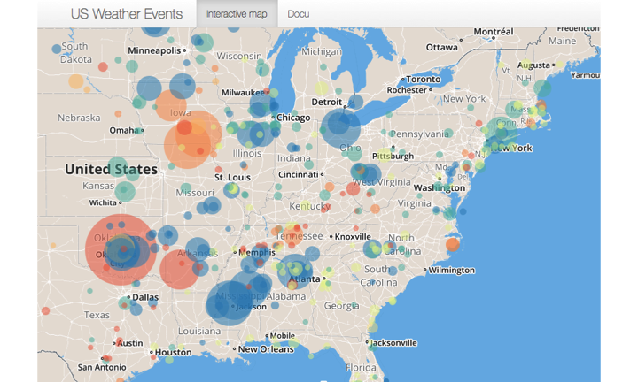
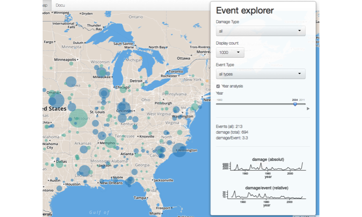
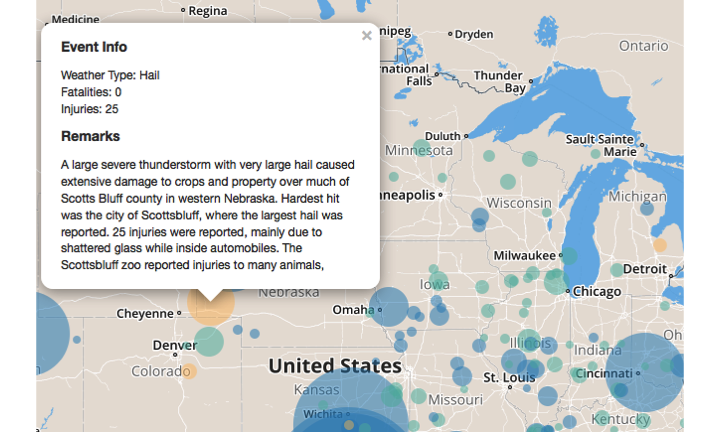

 

## Overview

Extrem weather-events such as Tornados and Floods can cause human lives. With the climate change, the probability of and therefore the danger of extrem weather events increases. 

For the US, the Shiny-App on "Exploring Weather Events" allows to visuallize number, impact and location of recorded events. 

 

--- 

## Event Explorer

The Event-explorer allows to select different event types, one or all years, the number of displayed events and the damage type. A short summary about the number of events and  relative/absolut caused damage provides a brief overview. 

Development over the years can be explored as animation (Play button under slider)

 

---

## Single Events

Clicking on an Event opens a popup with details about the Event.

 

--- 

## Impressum

**Data** US National Weather Service [here(PDF-file)](http://www.weather.gov/)

**Layout** based on [SuperZip App](https://github.com/jcheng5/superzip) by [Joe Cheng](https://github.com/jcheng5)

[Github Code](https://github.com/SteHyr/r_shiny_WeatherEvents) with documentation

[App Link ](https://stehyr.shinyapps.io/r_shiny_WeatherEvents/)
